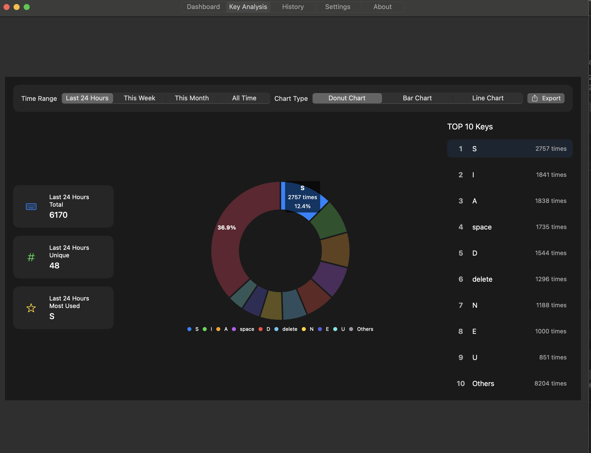
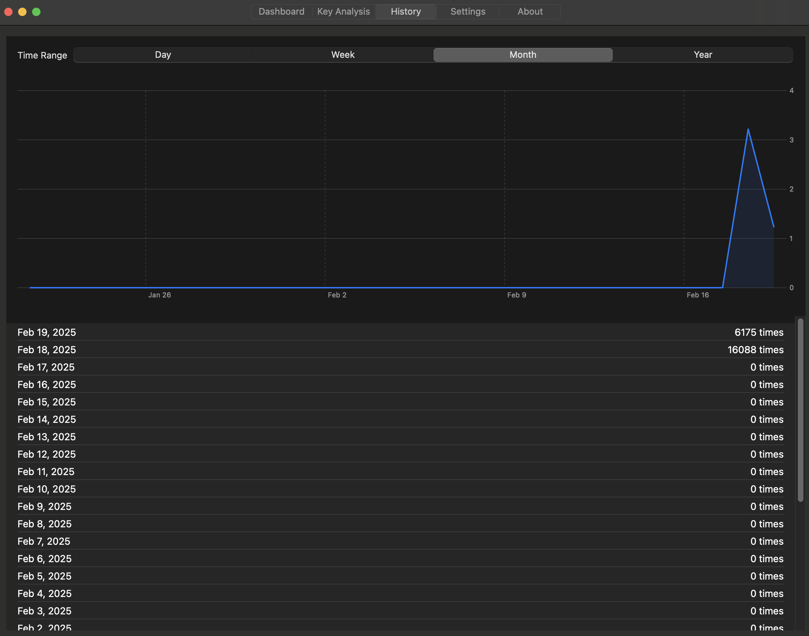

    

        ⌨️ KeyMetrics
    

  

  

    
    
    
    
  

  

    <a href="#核心特性">核心特性</a> •
    <a href="#界面展示">界面展示</a> •
    <a href="#开始使用">开始使用</a> •
    <a href="#技术特点">技术特点</a> •
    <a href="#关于作者">关于作者</a>
  

## ✨ 核心特性

### 🎨 实时数据可视化
KeyMetrics 为您带来身临其境的数据可视化体验。通过精心设计的实时速度仪表盘，您可以直观感受每一次击键的节奏与韵律。动态绚丽的键盘热力图将按键分布转化为视觉盛宴，优雅的按键特效则为您的每次输入都增添了独特的美感。在这里，数据不再是冰冷的数字，而是流动的艺术。

### 📊 专业数据分析
深度解析您的键盘使用习惯，让每一次击键都成为提升的契机。我们的分析系统不仅记录详尽的按键频率数据，更通过智能算法生成全方位的使用趋势报告。从日常练习到长期进步，KeyMetrics 都将是您最专业的陪伴。通过科学的数据分析，帮助您逐步优化打字技巧，提升工作效率。

### 🌈 个性化体验
您的舒适体验永远是我们的首要考虑。KeyMetrics 提供极致灵活的个性化选项，从优雅的深浅主题切换，到丰富多样的预设配色方案，再到个性化的字体选择，每一处细节都可以按照您的喜好进行调整。让每个用户都能打造专属的理想工作环境。

### 🌏 全球化视野
KeyMetrics 突破语言藩篱，为全球用户提供无障碍的使用体验。我们支持简体中文、繁体中文、English、日本語和한국어等多种语言，让来自世界各地的用户都能便捷地使用每一项功能。在这里，科技与人文完美融合，打造真正的全球化应用。

## 🖼 界面展示

  
  
<em>仪表盘 - 实时监控与数据展示</em>

  
  
<em>按键分析 - 深入了解使用习惯</em>

  
  
<em>历史记录 - 追踪长期使用趋势</em>

  
  
<em>设置中心 - 个性化您的体验</em>

## 🚀 开始使用

### 系统要求
- macOS 11.0 或更高版本
- 约 50MB 可用磁盘空间
- 需要授予辅助功能权限

### 安装步骤
1. 从 [Releases](https://github.com/yourusername/KeyMetrics/releases) 下载最新版本
2. 解压下载的 `KeyMetrics.zip` 文件
3. 将 KeyMetrics.app 拖入应用程序文件夹
4. 首次运行时按照提示授予必要权限

### 快速上手
1. 启动应用后，在状态栏找到 KeyMetrics 图标
2. 点击图标即可打开主面板
3. 开始享受专业的键盘分析体验

## 💡 技术特点

- **高效性能**：优化的数据处理算法，确保极低的系统资源占用
- **实时响应**：采用响应式设计，保证数据实时更新
- **数据安全**：本地数据存储，确保隐私安全
- **可扩展性**：模块化架构设计，便于功能扩展

## 📝 开发计划
- [ ] 优化核心监控引擎，提升数据采集效率，降低系统资源占用，确保在长时间运行时保持稳定的性能表现

- [ ] 引入智能主题系统，支持一键换肤功能，让用户能够根据心情和场景随时切换界面风格，打造沉浸式使用体验

- [ ] 扩展国际化支持，计划新增德语、法语、西班牙语等主流语言，让更多用户能够使用母语享受 KeyMetrics

- [ ] 集成更多高质量字体，提供专业的字体预览和实时切换功能，满足不同用户的个性化展示需求

- [ ] 深化数据分析能力，引入机器学习算法，为用户提供更专业的打字模式分析和个性化的提升建议

- [ ] 开发更丰富的数据可视化模块，通过直观的图表展示用户的进步轨迹，激发持续改进的动力

这些开发计划将根据用户反馈和实际需求持续调整和更新。我们致力于将 KeyMetrics 打造成最专业的键盘分析工具，欢迎提供您的建议和想法。

## 👨‍💻 关于作者

- 📧 QQ：1957689514
- 💬 Email：15968588744@163.com
- 🌟 欢迎通过以上方式与我交流或提供建议

## 📄 开源协议

本项目基于 MIT 协议开源，欢迎学习交流和二次开发。
